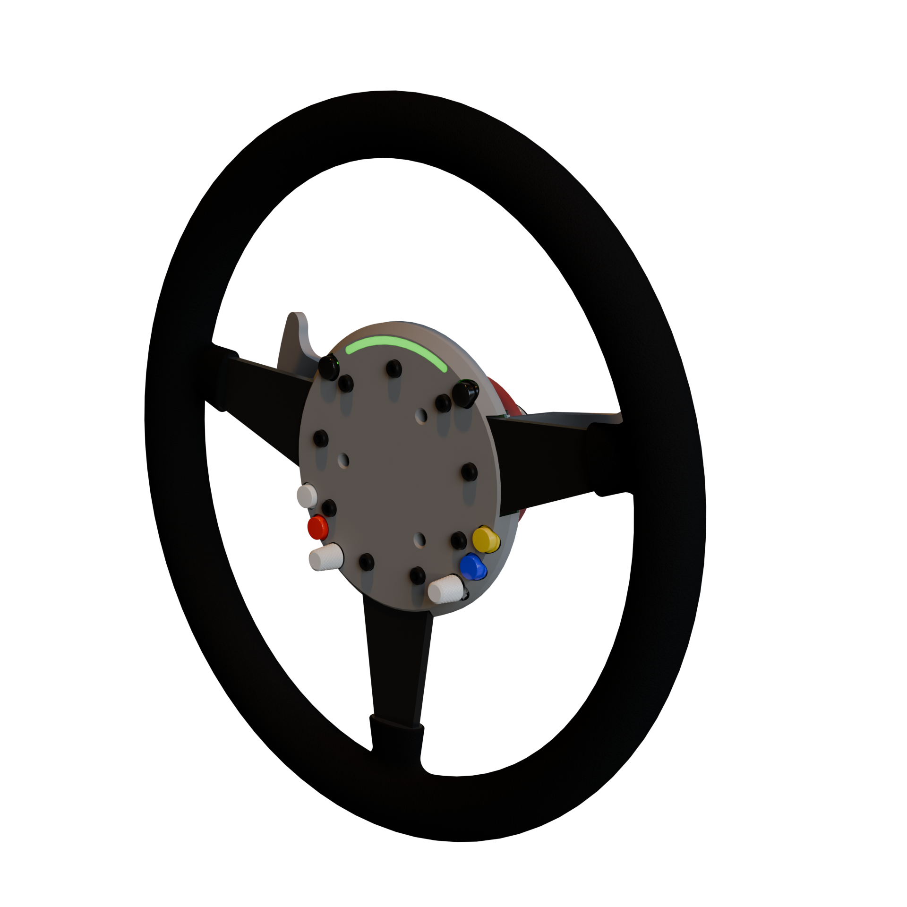

# ESP32 Steering Buttons

## What you will need

- A steering wheel
- A few buttons
- A few encoders
- ESP32-S3 Supermini
- Simagic QR70 Quick-release (I use this for powering the ESP32 on the board)

## Notes

This repository is more a demo than a guide for DIY wheel buttons for an ESP32.

It uses the lemmingdev/ESP32-BLE-Gamepad library to handle the joystick control component.

LED is WIP.
